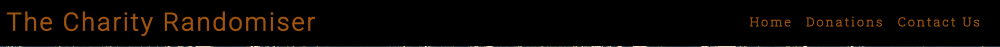
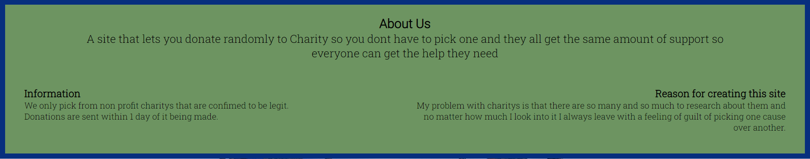
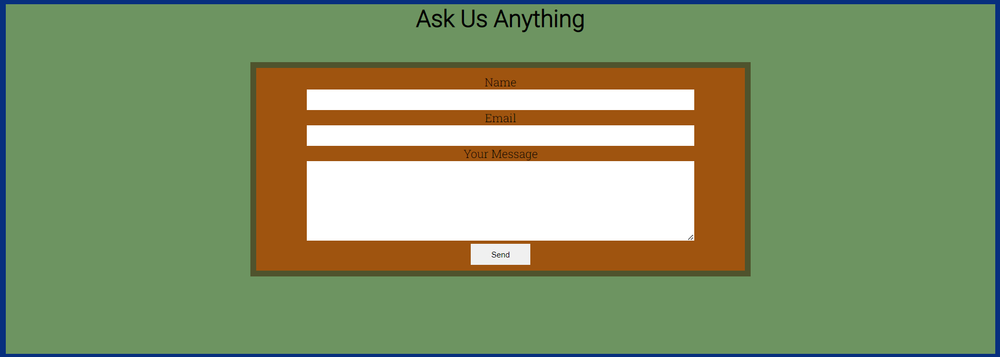
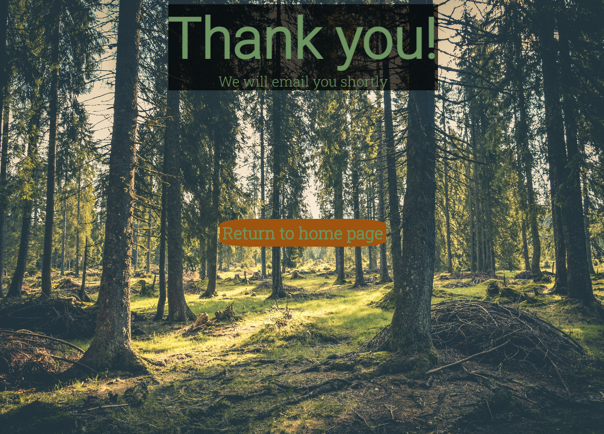

# Goal for this Project
Hello, my goal for this project is to make a site that lets you randomly donate to charity without having to do research and pick one which I personly find makes it harder to find one and also leaves me with a slight feeling of guilt for helping one cause and not another

I plan on making a home page with basic information about the site and places to contact me and make the donations themself

## User Goals
* Looks good with clear text.
* Everything is clear on what it does and how to use it.
* Feels smooth with little to no useless space.
## Site owners Goals
* Help others make random donations with ease.
* Make sure it has a good accesabilty score.
### Requirements
* Easy and fast to make donations.
* Make sure everything is clear on what it does
* Have a way to contact me
### Expectations
* That all links and navigations work as intended.
* That you can actully make donations via paypal (try to make it automaticly make donations but that would be another free time project for me to work on)
* Everything looks good on diffrent screen sizes

## Design Choices

### The Colors
#00194c text
#9f540f bg
#553261 text
#6d9461 bg

### Font choices
To make it all alittle diffrent I used fonts from [Google Fonts](https://fonts.google.com/ "Google Fonts") and decided to go for [Roboto Slab](https://fonts.google.com/specimen/Roboto+Slab?query=rob "Roboto Slab font") for the basic text as I feel it looks clean and just sits right with me while I went with [Roboto](https://fonts.google.com/specimen/Roboto "Roboto font") for my h1,h2 because it goes well with Roboto Slab and has the same clean look that I

# Features

## Existing Features

### Nav Bar/Header
* Navigation bar works as intended and responds to diffrent screen sizes and stays on the top of your screen at all times

* Also reacts to hovering as to make it easier to see what you are about to click

### Landing Page

* The landing page is an image of a forest with some information on what the site is about and why to use it

### About Us
* Simple about us page with a small amount of information and reason for creating the site

### Donation Page
* Options to donate via card or paypal
* Small text for reasons to donate

### Contact Us 
* Provieds a way to reach out and have any of your questions answered

### Footer
* Links to social that opens in a new tap
* Copyright

### Thank You Page
* Seperate html that you get sent to after making a donation or sending a message
* It has a thank you and a button to send you back to the main page

# Testing
For testing I have navigated through all the combinations of actions you could do and tried to push it,
everything respons properly to diffrent screen sizes and is just as accesible and clear with no issues at all,
during testing I noticed that the paypal feature I added was creating errors on the W3C Validator so I tried to resolve this issue but
even with the normal code given by paypal it wouldn't let you log in which I found very strange.

## Validator Test

### HTML
* No errors going through the offical 
### CSS
* No errors going through the offical

## Unfixed Bugs
Bug with paypal option not letting you log in and says that some details are missing even when using the default code provided by paypal
This was not fixed due to lack of time and as of now lack of knowledge over it

# Deployment
The site was deployed onto github by uploading the code into a github repository and from there making the repository public so I could go into the page tab in the settings, from there selecting the source as the master branch and saving.

Link to site - https://kakguden.github.io/Site-for-project-1/

# Credits 
## Content
* Paypal button was take from the offical paypal site
* Icons used in the footer where taken from - https://fontawesome.com/
## Media
* Images used was taken from - https://www.pexels.com/